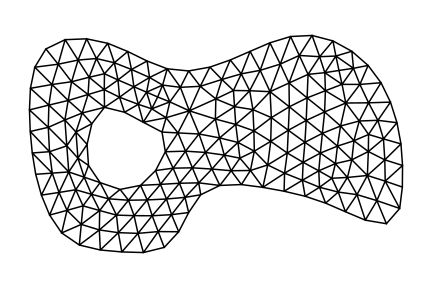

# gmshparser - parse Gmsh .msh file format

[![Python CI - Status][gh-ci-img]][gh-ci-url]
[![PyPI - Version][pypi-img]][pypi-url]
[![PyPI - Downloads][pypi-dl-img]][pypi-dl-url]
[![Coverate Status][coveralls-img]][coveralls-url]
[![Documentation Status][documentation-img]][documentation-url]

Package author: Jukka Aho (@ahojukka5)

Gmshparser is a small Python package which aims to do only one thing: parse Gmsh
mesh file format. Package does not have any external dependencies to other
packages and it aims to be a simple stand-alone solution for a common problem:
how to import mesh to your favourite research FEM code?

- Project source in GitHub: [https://github.com/ahojukka5/gmshparser](https://github.com/ahojukka5/gmshparser)
- Project documentation in ReadTheDocs: [https://gmshparser.readthedocs.io](https://gmshparser.readthedocs.io)
- Project releases in PyPi: [https://pypi.org/project/gmshparser](https://pypi.org/project/gmshparser)

## Installing package

To install the most recent package from Python Package Index (PyPi), use git:

```bash
pip install gmshparser
```

To install the development version, you can install the package directly from
the GitHub:

```bash
pip install git+git://github.com/ahojukka5/gmshparser.git
```

## Using application programming interface

To read mesh into `Mesh` object, use command `parse`. It takes a filename and
parses the file with the set of parsers, defined in `DEFAULT_PARSERS` (see
developing package section for more info..!)

```python
import gmshparser
mesh = gmshparser.parse("data/testmesh.msh")
print(mesh)
```

```text
Mesh name: data/testmesh.msh
Mesh version: 4.1
Number of nodes: 6
Minimum node tag: 1
Maximum node tag: 6
Number of node entities: 1
Number of elements: 2
Minimum element tag: 1
Maximum element tag: 2
Number of element entities: 1
```

After reading the model, you can querying your data form `mesh` object. For
example, to extract all nodes from the model:

```python
for entity in mesh.get_node_entities():
    for node in entity.get_nodes():
        nid = node.get_tag()
        ncoords = node.get_coordinates()
        print("Node id = %s, node coordinates = %s" % (nid, ncoords))
```

```text
Node id = 1, node coordinates = (0.0, 0.0, 0.0)
Node id = 2, node coordinates = (1.0, 0.0, 0.0)
Node id = 3, node coordinates = (1.0, 1.0, 0.0)
Node id = 4, node coordinates = (0.0, 1.0, 0.0)
Node id = 5, node coordinates = (2.0, 0.0, 0.0)
Node id = 6, node coordinates = (2.0, 1.0, 0.0)
```

Extract all elements from the model:

```python
for entity in mesh.get_element_entities():
    eltype = entity.get_element_type()
    print("Element type: %s" % eltype)
    for element in entity.get_elements():
        elid = element.get_tag()
        elcon = element.get_connectivity()
        print("Element id = %s, connectivity = %s" % (elid, elcon))
```

```text
Element type: 3
Element id = 1, connectivity = [1, 2, 3, 4]
Element id = 2, connectivity = [2, 5, 6, 3]
```

If you are writing your FEM stuff with Python, then you have access to the all
relevant properties of the model using `mesh` object. For further information on
how to access nodes, elements, physical groups, and other things what Gmsh
provides, take a look of [documentation](https://gmshparser.readthedocs.io).

### Using command line interface

gmshparser can also be useful even if you don't make FEM code in Python. The
above loops used to extract nodes and elements are actually so common, that you
can use them from the command line. This way you can print nodes and elements in
a simpler format with command-line tools, making it easier to read an element
mesh with C ++ or Fortran, for example. To extract nodes:

```bash
jukka@jukka-XPS-13-9380:~$ gmshparser data/testmesh.msh nodes
```

```text
6
1 0.000000 0.000000 0.000000
2 1.000000 0.000000 0.000000
3 1.000000 1.000000 0.000000
4 0.000000 1.000000 0.000000
5 2.000000 0.000000 0.000000
6 2.000000 1.000000 0.000000
```

To extract elements, use choice `elements`. The first line is having the total
number of elements, and the rest of the lines are in format `element_id
element_type element_connectivity`. The length of the line naturally depends on
how many nodes the element is having.

```bash
jukka@jukka-XPS-13-9380:~$ gmshparser data/testmesh.msh elements
```

```text
2
1 3 1 2 3 4
2 3 2 5 6 3
```

### Visualizing meshes using gmshparser and matplotlib

The intention of the package is not to visualize meshes. But as it is a quite
common task to visualize 2-dimensional triangluar meshes in acedemic papers,
lecture notes, and things like that, it can be done easily using gmshparser and
matplotlib. There's a helper function `gmshparser.helpers.get_triangles`, which
returns a tuple `(X, Y, T)` which can then be passed to matplotlib to get a mesh
plot:

```python
import gmshparser
mesh = gmshparser.parse("data/example_mesh.msh")
X, Y, T = gmshparser.helpers.get_triangles(mesh)

import matplotlib.pylab as plt
plt.figure()
plt.triplot(X, Y, T, color='black')
plt.axis('equal')
plt.axis('off')
plt.tight_layout()
plt.savefig('docs/example_mesh.svg')
```



## Developing package

gmshparser is written such a way, that it's easy to define your own parsers
which are responsible for parsing some section, starting with `$SectionName` and
ending with `$EndSectionName`. For example, a parser which is responsible to
parse `MeshFormat` setion is `MainFormatParser` and it is defined with the
following code:

```python
class MeshFormatParser(AbstractParser):

    @staticmethod
    def get_section_name():
        return "$MeshFormat"

    @staticmethod
    def parse(mesh: Mesh, io: TextIO) -> None:
        s = io.readline().strip().split(" ")
        mesh.set_version(float(s[0]))
        mesh.set_ascii(int(s[1]) == 0)
        mesh.set_precision(int(s[2]))
```

All the active parsers used in parsing are then appended to the list of parsers
in [MainParser](gmshparser/main_parser.py), from where they are called when an
appropriate `get_section_name()` is found from file considered to be parsed. The
`MainParser` itself is then called in `parse` to get things done:

```python
def parse(filename: str) -> Mesh:
    """Parse Gmsh .msh file and return `Mesh` object."""
    mesh = Mesh()
    mesh.set_name(filename)
    parser = MainParser()
    with open(filename, "r") as io:
        parser.parse(mesh, io)
    return mesh
```

If you want to learn how to write your own parser, you can e.g. take of look of
[NodesParser](gmshparser/nodes_parser.py) which is responsible for parsing nodes
and [ElementsParser](gmshparser/elements_parser.py) which is responsible for
parsing elements, to get an idea how things are implemented.

## Contributing to project

Like in all other open source projects, contributions are always welcome to this
project too! If you have some great ideas how to make this package better,
feature requests etc., you can open an issue on gmshparser's [issue
tracker][issues] or contact me (ahojukka5@gmail.com) directly.

[gh-ci-img]: https://github.com/ahojukka5/gmshparser/workflows/Python%20CI/badge.svg
[gh-ci-url]: https://github.com/ahojukka5/gmshparser/actions
[travis-img]: https://travis-ci.com/ahojukka5/gmshparser.svg?branch=master
[travis-url]: https://travis-ci.com/ahojukka5/gmshparser
[coveralls-img]: https://coveralls.io/repos/github/ahojukka5/gmshparser/badge.svg?branch=master
[coveralls-url]: https://coveralls.io/github/ahojukka5/gmshparser?branch=master
[pypi-img]: https://img.shields.io/pypi/v/gmshparser
[pypi-url]: https://pypi.org/project/gmshparser
[pypi-dl-img]: https://img.shields.io/pypi/dm/gmshparser
[pypi-dl-url]: https://pypi.org/project/gmshparser
[documentation-img]: https://readthedocs.org/projects/gmshparser/badge/?version=latest
[documentation-url]: https://gmshparser.readthedocs.io/en/latest/?badge=latest
[issues]: https://github.com/ahojukka5/gmshparser/issues
[gmsh]: https://gmsh.info/
