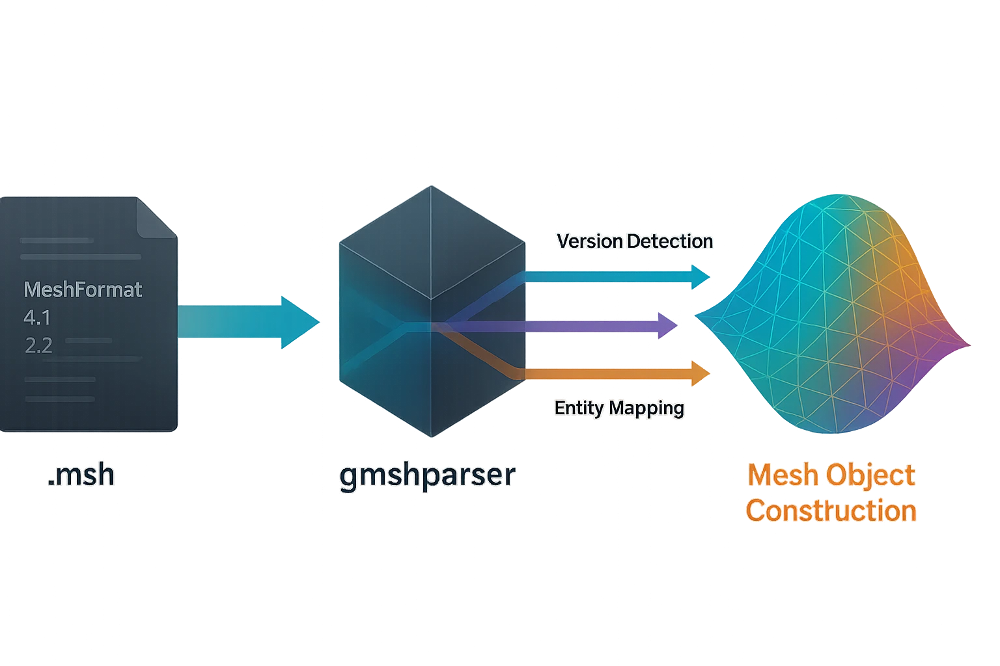

# gmshparser — parse Gmsh `.msh` files

[![Python CI][gh-ci-img]][gh-ci-url]
[![codecov][codecov-img]][codecov-url]
[![PyPI - Version][pypi-img]][pypi-url]
[![PyPI - Downloads][pypi-dl-img]][pypi-dl-url]
[![Documentation][docs-img]][docs-url]
[![Python Version][python-img]][pypi-url]
[![License][license-img]][license-url]



gmshparser is a small, dependency-free Python package for reading **ASCII**
[Gmsh](https://gmsh.info/) MSH files. It provides a modern immutable API for
normal application code while retaining the original parser-oriented API for
backward compatibility.

- **Python:** 3.12 or newer
- **MSH formats:** 1.0, 2.0, 2.1, 2.2, 4.0, and 4.1
- **Core dependencies:** none
- **Scope:** reading meshes; writing and binary MSH files are not supported

Project links:

- [Documentation](https://ahojukka5.github.io/gmshparser/)
- [PyPI package](https://pypi.org/project/gmshparser)
- [Issue tracker](https://github.com/ahojukka5/gmshparser/issues)

## Installation

Install the stable release with uv:

```bash
uv add gmshparser
```

or with pip:

```bash
pip install gmshparser
```

Install the current development version directly from GitHub:

```bash
uv add "gmshparser @ git+https://github.com/ahojukka5/gmshparser.git"
```

## Pythonic API

Use `read()` for new code:

```python
import gmshparser

mesh = gmshparser.read("mesh.msh")
print(mesh.version, len(mesh.nodes), len(mesh.elements))
```

Collections iterate over value objects and use original Gmsh tags for lookup:

```python
for node in mesh.nodes:
    print(node.tag, node.x, node.y, node.z)

node = mesh.nodes[42]
element = mesh.elements[17]
```

Elements link directly to their nodes and expose a typed element kind:

```python
from gmshparser.api import ElementType

triangles = mesh.elements.by_type(ElementType.TRIANGLE)

for triangle in triangles:
    print(triangle.tag, triangle.node_tags)
    for node in triangle:
        print(node.coordinates)
```

Entity context is available without separate node and element block APIs:

```python
entity = mesh.entities[(2, 7)]
print(len(entity.nodes), len(entity.elements), entity.element_types)
```

`read()` also accepts open text streams. See the
[Pythonic API guide](https://ahojukka5.github.io/gmshparser/user-guide/pythonic-api/)
for the complete model.

## Compatibility API

Existing applications using the original mutable `get_*` / `set_*` model can
continue unchanged:

```python
legacy_mesh = gmshparser.parse("mesh.msh")

for entity in legacy_mesh.get_node_entities():
    for node in entity.get_nodes():
        print(node.get_tag(), node.get_coordinates())
```

The parser detects the MSH version automatically in both APIs.

## Command-line interface

The installed `gmshparser` command can print a mesh summary, nodes, or elements:

```bash
gmshparser mesh.msh info
gmshparser mesh.msh nodes
gmshparser mesh.msh elements
gmshparser --version
```

`nodes` output begins with the node count, followed by
`node_id x y z`. `elements` output begins with the element count, followed by
`element_id element_type connectivity...`.

## Visualization helpers

Matplotlib is optional. Helpers accept both the modern and compatibility mesh
models:

```python
import gmshparser
import matplotlib.pyplot as plt

mesh = gmshparser.read("mesh.msh")
X, Y, triangles = gmshparser.helpers.get_triangles(mesh)
plt.triplot(X, Y, triangles)
plt.axis("equal")
plt.show()
```

Install the optional dependency separately:

```bash
uv add matplotlib
```

## Development

The repository uses uv and intentionally does not commit dependency lock files.
Ruff provides both formatting and linting.

```bash
git clone https://github.com/ahojukka5/gmshparser.git
cd gmshparser
uv sync
uv run ruff format --check gmshparser tests examples
uv run ruff check gmshparser tests examples
uv run pytest
```

Build the documentation with:

```bash
uv sync --group docs
uv run mkdocs build
```

See the [Contributing guide](https://ahojukka5.github.io/gmshparser/developer-guide/contributing/)
for dependency groups and the release workflow.

## License

gmshparser is released under the MIT License.

[gh-ci-img]: https://github.com/ahojukka5/gmshparser/actions/workflows/python.yml/badge.svg
[gh-ci-url]: https://github.com/ahojukka5/gmshparser/actions/workflows/python.yml
[codecov-img]: https://codecov.io/gh/ahojukka5/gmshparser/branch/master/graph/badge.svg
[codecov-url]: https://codecov.io/gh/ahojukka5/gmshparser
[pypi-img]: https://img.shields.io/pypi/v/gmshparser
[pypi-url]: https://pypi.org/project/gmshparser
[pypi-dl-img]: https://img.shields.io/pypi/dm/gmshparser
[pypi-dl-url]: https://pypi.org/project/gmshparser
[docs-img]: https://img.shields.io/badge/docs-GitHub%20Pages-blue
[docs-url]: https://ahojukka5.github.io/gmshparser/
[python-img]: https://img.shields.io/pypi/pyversions/gmshparser
[license-img]: https://img.shields.io/github/license/ahojukka5/gmshparser
[license-url]: https://github.com/ahojukka5/gmshparser/blob/master/LICENSE
